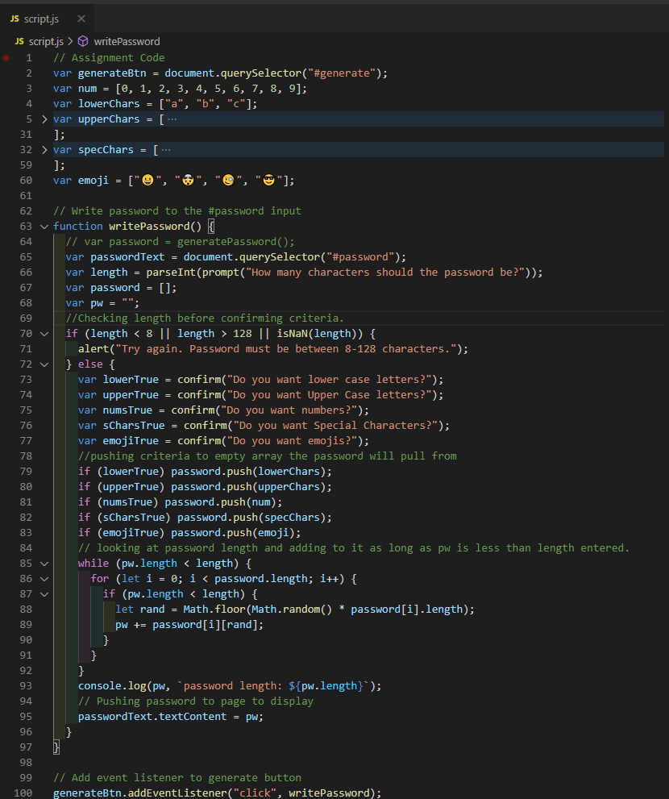

# 03 JavaScript: Password Generator

## Notes

This took me a bit longer than expected. When I first started I spent a fair amount of time looking over the existing code to understand what did what, where my code would go, and how it would interact with it.

- I adjusted the order of the prompts/confirms as it made more sense to me to check the length conditions first and group the main criteria under one if else statement.

- I included emjois as my teacher made it a bonus objective to include & it adds more security to the password generator.

- Consider having one array for Characters that was all caps and then using .toLowerCase to make the lower case option available to the password array after confirming if lower case criteria was wanted. Decided it would be easier and quicker to make lower case it's own array.

- Had a little trouble with the password pushing to the text area after it generated, but was able to sort it out after messing with .value and .textContent.

Screen Shot of my code & original instructions listed below.



## Your Task

This week’s homework requires you to create an application that an employee can use to generate a random password based on criteria they’ve selected by modifying starter code. This app will run in the browser, and will feature dynamically updated HTML and CSS powered by JavaScript code that you write. It will have a clean and polished user interface that is responsive, ensuring that it adapts to multiple screen sizes.

The password can include special characters. If you’re unfamiliar with these, see this [list of Password Special Characters from the OWASP Foundation](https://www.owasp.org/index.php/Password_special_characters).

## User Story

```
AS AN employee with access to sensitive data
I WANT to randomly generate a password that meets certain criteria
SO THAT I can create a strong password that provides greater security
```

## Acceptance Criteria

```
GIVEN I need a new, secure password
WHEN I click the button to generate a password
THEN I am presented with a series of prompts for password criteria
WHEN prompted for password criteria
THEN I select which criteria to include in the password
WHEN prompted for the length of the password
THEN I choose a length of at least 8 characters and no more than 128 characters
WHEN prompted for character types to include in the password
THEN I choose lowercase, uppercase, numeric, and/or special characters
WHEN I answer each prompt
THEN my input should be validated and at least one character type should be selected
WHEN all prompts are answered
THEN a password is generated that matches the selected criteria
WHEN the password is generated
THEN the password is either displayed in an alert or written to the page
```

## Mock-Up

The following image shows the web application's appearance and functionality:


## Grading Requirements

This homework is graded based on the following criteria:

### Technical Acceptance Criteria: 40%

- Satisfies all of the above acceptance criteria plus the following:

  - The homework should not produce any errors in the console when you inspect it using Chrome DevTools.

### Deployment: 32%

- Application deployed at live URL.

- Application loads with no errors.

- Application GitHub URL submitted.

- GitHub repository that contains application code.

### Application Quality: 15%

- Application user experience is intuitive and easy to navigate.

- Application user interface style is clean and polished.

- Application resembles the mock-up functionality provided in the homework instructions.

### Repository Quality: 13%

- Repository has a unique name.

- Repository follows best practices for file structure and naming conventions.

- Repository follows best practices for class/id naming conventions, indentation, quality comments, etc.

- Repository contains multiple descriptive commit messages.

- Repository contains quality README file with description, screenshot, and link to deployed application.

## Review

You are required to submit the following for review:

- The URL of the deployed application.

- The URL of the GitHub repository. Give the repository a unique name and include a README describing the project.

---

© 2020 Trilogy Education Services, a 2U, Inc. brand. All Rights Reserved.
